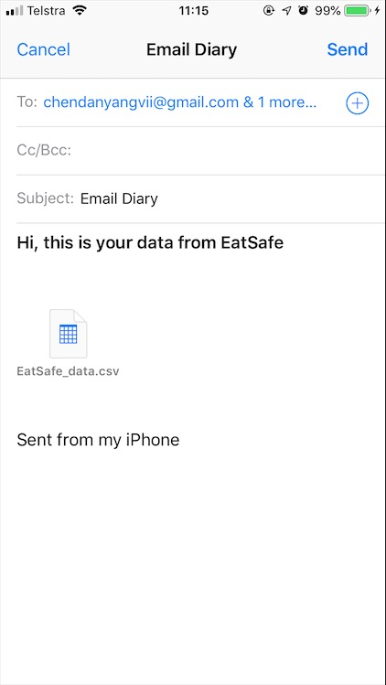

# EatSafe V2.0

The first iteration of EatSafe in https://github.com/stevechanvii/EatSafe

For version 2, we set up text recognition (by Google Machine Learning) to extract the ingredients
from product wrapping, so that can analysis the allergens.

## Getting Started

This App is proudly produced by team Hygieia

## Diary


## Scanning


## Text Recognition


## Report


## Profile



### Prerequisites

Android:
JDK 8
Android studio

iOS:
xCode

VS Code

### Installing

Firstly, the environment should be setup, please refer to React Native offical site: https://facebook.github.io/react-native/docs/getting-started

Choose your environment in React Native CLI Quickstart tab, follow the insrutction and install Node, Watchman, React Native CLI, etc.


Download the code, go to project root directory and install packages, dependencies
```
npm install
```

If you want to run the project in Xcode, go to ios folder
```
pod install
```
Then, open EatSafe.xcworkspace clean and rebuild project


Running on simulator
For Android, open Android studio and clean and rebuild first, then open simulator, and go to project root directory in terminal
```
react-native run-android
```

Sometime may have problems with abd (Android debug tools), be aware to change the user directory below (use your own path)
```
export PATH="$PATH:/Users/stevechanvii/Library/Android/sdk/platform-tools":$PATH
```

For iOS, go to project root directory in terminal
```
react-native run-ios
```

There will be many problems running on Xcode, so Google them or create an issue. If it still not working properly, just try on android. If you want to running on real device, make sure your laptop and mobile device under same network.

## Running the tests

Explain how to run the automated tests for this system

### Break down into end to end tests

Explain what these tests test and why

```
Give an example
```

### And coding style tests

Explain what these tests test and why

```
Give an example
```

## Deployment

Add additional notes about how to deploy this on a live system

## Built With

* [React Native](https://facebook.github.io/react-native/docs/tutorial) - The app framework used
* [Text Recognition](https://firebase.google.com/docs/ml-kit/recognize-text) - Machine Learning

## Contributing

Useful Link
* React: https://reactjs.org
* React Native: https://facebook.github.io/react-native/docs/tutorial
* Navigation: https://reactnavigation.org/en/
* Navigation API Reference: https://reactnavigation.org/docs/en/navigation-prop.html#addlistener-subscribe-to-updates-to-navigation-lifecycle
* NativeBase: https://docs.nativebase.io
* Easy Grid: https://github.com/GeekyAnts/react-native-easy-grid
* Vector Icons: https://github.com/oblador/react-native-vector-icons
* Camera: https://github.com/react-native-community/react-native-camera
* Barcode Mask: https://github.com/shahnawaz/react-native-barcode-mask
* Async Storage: https://github.com/react-native-community/react-native-async-storage
* Datetiem picker: https://github.com/mmazzarolo/react-native-modal-datetime-picker/blob/master/README.md
* Textinput Effects:https://github.com/halilb/react-native-textinput-effects
* Floating Action Button: https://github.com/santomegonzalo/react-native-floating-action#readme
* Modal: https://github.com/react-native-community/react-native-modal
* Net Information: https://github.com/react-native-community/react-native-netinfo
* Flexbox: https://css-tricks.com/snippets/css/a-guide-to-flexbox/
* Google Machine Learning (Text Recognition): https://firebase.google.com/docs/ml-kit/recognize-text
* Firebase: https://firebase.google.com/docs/firestore/
* String Similarity: https://github.com/aceakash/string-similarity
* Open Food Fact: https://en.wiki.openfoodfacts.org/API/Read/Product
* Mail: https://github.com/chirag04/react-native-mail
* File System: https://github.com/itinance/react-native-fs
* JSON to CSV: https://github.com/zemirco/json2csv
* PDF Generator: https://github.com/Hopding/react-native-pdf-lib
* Chart Kit: https://github.com/indiespirit/react-native-chart-kit

Guidance
* https://github.com/okgrow/react-native-copilot
* https://github.com/frichti/react-native-tips

Splash Screen
* https://github.com/fuyaode/react-native-app-intro
* https://github.com/crazycodeboy/react-native-splash-screen
* https://github.com/Jacse/react-native-app-intro-slider

3D touch
* https://github.com/jordanbyron/react-native-quick-actions

icon
* https://stackoverflow.com/questions/34329715/how-to-add-icons-to-react-native-app

resource
* https://github.com/jondot/awesome-react-native

touch id
https://github.com/naoufal/react-native-touch-id


Thank you for all the communities and programmers who provide so amazing open source libraries. 

## Versioning

We use github for versioning. The first iteration of EatSafe please refer to https://github.com/stevechanvii/EatSafe For the versions available, see the [tags on this repository](https://github.com/stevechanvii/EatSafe-v2). 

## Authors

* **Danyang Chen** - *Initial work* - [GitHub](https://github.com/stevechanvii)

See also the list of [contributors](https://github.com/your/project/contributors) who participated in this project.

## License

This project is licensed under the Apache License - see the [LICENSE.md](LICENSE.md) file for details

## Acknowledgments

* Produced by Team Hygieia (Danyang Chen, Souvic Chaki, Santash Ashok Pawar, Lili Zhou, Zizhang Ba)
* Inspiration
* Some icons from icons8 (https://icons8.com/license), read the license before using, https://stackoverflow.com/questions/38830568/how-to-show-svg-file-on-react-native guide for how to use svg in project
